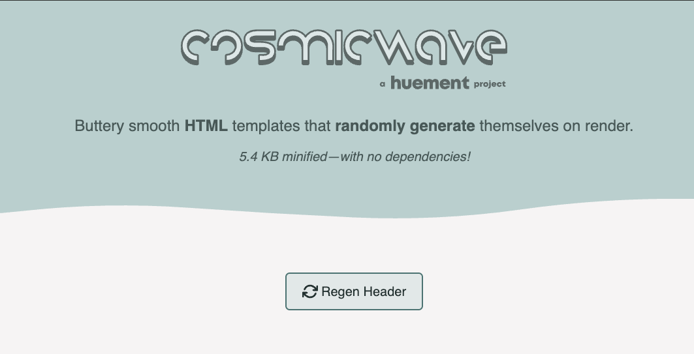

# CosmicWave



Create dynamic SVG '**waves**' on each page render or animate them for never ending movement. Each wave is tied to a single HTML element whose attributes control the wave parameters.

## CosmicPoly

Now with **100%** more polygon edges! There is a new version of the script that instead of smooth waves, does a more cyberpunk polygon version. Its very cool. Same markup and properties as the OG wave, just use the new version of the file, `cosmicpoly`.

## USAGE

the holy trinity of JS+CSS+HTML could not be simplier to setup.

## Javascript

```javascript
import '@huement/cosmicwave'

// OR CDN URL
<script src="https://cdn.jsdelivr.net/gh/huement/CosmicWave@main/dist/cosmicwave.min.js" crossorigin="anonymous"></script>
```

### Markup

```html
<!-- Easy Peasy! -->
<cosmic-wave data-start-zero=true></cosmic-wave>
```

```html
<!-- Polygon version with more attributes & animation engaged -->
<cosmic-poly data-wave-face="bottom" data-wave-points="10" data-wave-animate="true"></cosmic-poly>
```

[Documentation + Examples](https://huement.github.io/CosmicWave)

### ADVANCED USAGE

You can 'control' the randomness to make certain things possible, such as having the wave start or end at zero. this can be helpful if you want to create a seamless experience, where you may wany just the middle to have a wave, or have the wave 'fall' to one side or the other. You can do this by using the `data-start-zero=true` and / or `data-end-zero=true`. See the documentation for more details and examples.

## OPTIONS

Here are all the options for configuring the wave via HTML data attributes:

| Command (Attribute) | Type | Details |
| :--- | :--- | :--- |
| `data-wave-face` | String | Dictates the direction the wave faces (`"top"`, `"bottom"`, `"left"`, or `"right"`). Default is `"top"`. |
| `data-wave-points` | Number | The number of anchor points used to generate the wave path. Default is `6`. |
| `data-variance` | Number | The variance factor controlling the randomness and height of the wave peaks. Default is `3`. |
| `data-wave-speed` | Number | The default duration of a continuous animation loop in milliseconds. Default is `7500`. |
| `data-start-end-zero` | Boolean | If `"true"`, forces both the start and end points of the wave to flatline at zero. Default is `false`. |
| `data-start-zero` | Boolean | If `"true"`, forces only the starting point of the wave to flatline at zero. Default is `false`. |
| `data-end-zero` | Boolean | If `"true"`, forces only the ending point of the wave to flatline at zero. Default is `false`. |
| `data-wave-observe` | String | Configures an `IntersectionObserver` to trigger a new wave shape when the element leaves the viewport. Format is `mode:rootMargin` (e.g., `"once:0px"` or `"continuous:10px"`). |
| `data-wave-animate` | Boolean | If `"true"`, the wave animation automatically begins looping immediately on load (automatically respects `prefers-reduced-motion`). |
